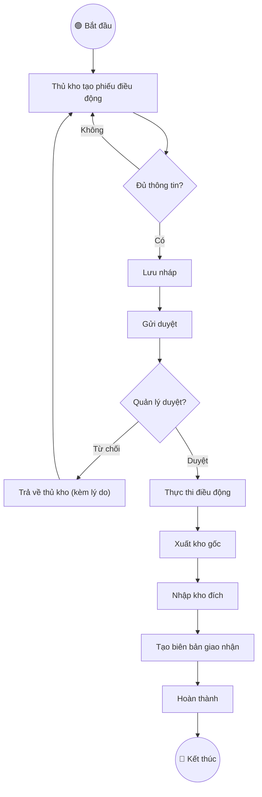
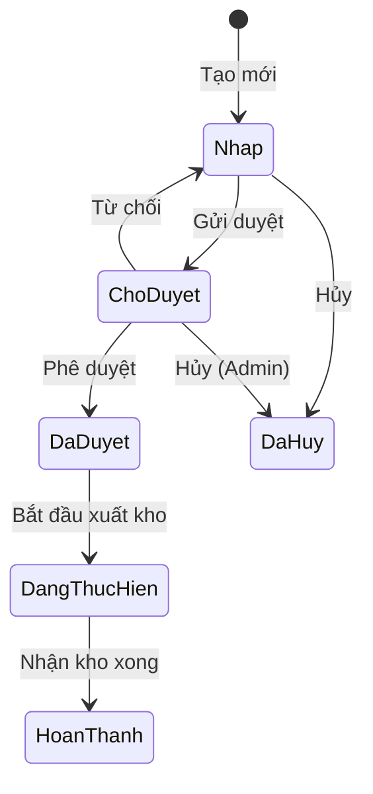

# Ví dụ: Spec Điều động thiết bị

> Đây là ví dụ minh họa output của skill khi chạy **Generate Mode** cho
> tính năng Điều động thiết bị (Dispatch Order) trong hệ thống IMS.

---

# 📑 Mục lục
- [Thông tin quản lý](#thông-tin-quản-lý)
- [Level 1 – Product Overview](#level-1--product-overview)
- [Level 2 – Epic / Module](#level-2--epicmodule)
- [Level 3 – Feature Detail](#level-3--feature-detail)
- [Level 4 – Sub-feature](#level-4--sub-feature-danh-sách-điều-động)
- [Thông tin bổ sung](#thông-tin-bổ-sung-nfr)
- [Gap Report](#gap-analysis-report)

---

# PRODUCT REQUIREMENT DOCUMENT (PRD/SPEC)

---

## 📋 THÔNG TIN QUẢN LÝ
- **Feature ID & Name:** `IMS_DD_01` - Điều động thiết bị
- **Module:** Quản lý kho / Điều động
- **Author (BA):** Nguyễn Văn A
- **PM / Owner:** Trần Thị B
- **Status:** 🏷️ Approved
- **Target Release / Sprint:** Sprint 12
- **Created:** 01/02/2024
- **Last Updated:** 15/03/2024

### 🔄 Lịch sử thay đổi (Changelog)
| Ngày | Người thay đổi | Nội dung cập nhật | Version |
|------|----------------|-------------------|---------|
| 01/02/2024 | Nguyễn Văn A | Tạo mới spec | 1.0 |
| 20/02/2024 | Nguyễn Văn A | Thêm BR_04 barcode scan, sửa State Machine | 1.1 |
| 10/03/2024 | Trần Thị B | CR_001: Thêm field "Lý do điều động" | 1.2 |

### 📐 SCOPE BASELINE (Sau khi Approved ở v1.0)
| Metric | Count |
|--------|-------|
| Business Rules | 5 |
| Acceptance Criteria | 12 |
| API Endpoints | 6 |
| DB Tables affected | 3 |
| States in Machine | 5 |
| UI Fields | 14 |
| Estimated Effort | L |

### 📋 CHANGE REQUEST LOG
| CR # | Ngày | Nguồn | Mô tả thay đổi | Before → After | Impact | Status |
|------|------|-------|-----------------|----------------|--------|--------|
| CR_001 | 10/03 | 🔵 Khách hàng | Thêm field "Lý do điều động" | 14 fields → 15 fields | +0.5 MD | ✅ Approved |

---

## LEVEL 1 – PRODUCT OVERVIEW

### 1.1. Overview
* **Bài toán:** Doanh nghiệp cần điều chuyển thiết bị (máy móc, công cụ) giữa các kho / dự án / chi nhánh. Hiện tại quản lý bằng Excel, dễ thất lạc, không track được lịch sử.
* **Giá trị mang lại:** Số hóa quy trình điều động, track real-time vị trí thiết bị, có lịch sử đầy đủ cho audit.
* **Scope:**
  * ✅ IN: Tạo/duyệt/thực thi phiếu điều động, track thiết bị, báo cáo
  * ❌ OUT: Bảo trì thiết bị, khấu hao, thanh lý

### 1.2. User Personas
| Role | Tên vai trò | Quyền hạn chính | Tần suất |
|------|------------|-----------------|----------|
| `thu_kho` | Thủ kho | Tạo, sửa, gửi duyệt phiếu | Hàng ngày |
| `quan_ly_kho` | Quản lý kho | Duyệt / từ chối phiếu | Hàng ngày |
| `ke_toan` | Kế toán | Xem phiếu, xác nhận tài sản | Tuần |
| `admin` | Quản trị hệ thống | Full quyền + cấu hình | Khi cần |

### 1.3. Stakeholder / RACI Matrix
| Vai trò | R | A | C | I |
|---------|---|---|---|---|
| BA (Nguyễn Văn A) | ✅ | | | |
| PM (Trần Thị B) | | ✅ | | |
| Dev Team | | | ✅ | |
| QA | | | | ✅ |
| Kế toán trưởng | | | ✅ | |

### 1.5. Glossary
| Thuật ngữ | Định nghĩa | EN |
|-----------|-----------|-----|
| Phiếu điều động | Chứng từ ghi nhận việc di chuyển thiết bị giữa 2 đơn vị | Dispatch Order |
| Kho xuất | Kho/dự án nơi thiết bị đang ở | Source Warehouse |
| Kho nhận | Kho/dự án nơi thiết bị sẽ đến | Destination Warehouse |
| Biên bản giao nhận | Tài liệu xác nhận thực tế giao/nhận thiết bị | Handover Record |

---

## LEVEL 2 – EPIC / MODULE

### 2.1. Sơ đồ quy trình nghiệp vụ

### 2.2. Feature & Impact Matrix
| Feature ID | Tên | Dependencies | Risk |
|-----------|-----|-------------|------|
| IMS_DD_01 | Điều động thiết bị | Quản lý kho (IMS_KHO), Quản lý thiết bị (IMS_TB) | Cao |

### 2.3. Estimation Hints
| Metric | Count | Complexity |
|--------|-------|------------|
| Màn hình mới | 4 | Danh sách, Chi tiết, Form tạo/sửa, In phiếu |
| API endpoints | 6 | CRUD + status transition + export |
| Business Rules | 5 | Tính phức tạp TB |
| **Tổng ước lượng** | | **L (8-13 MD)** |

### 2.4. Risk Assessment
| Risk | Probability | Impact | Mitigation |
|------|------------|--------|------------|
| Race condition khi 2 người duyệt cùng lúc | Thấp | Cao | Optimistic lock với version field |
| Thiết bị đang bảo trì mà bị điều động | TB | Cao | Check status thiết bị trong BR |
| Data migration từ Excel hiện tại | Cao | TB | Script import + validation |

---

## LEVEL 3 – FEATURE DETAIL

### 3.1. User Story
**As a** `thu_kho`, **I want to** tạo và gửi phiếu điều động thiết bị, **so that** quản lý có thể duyệt và thiết bị được chuyển đúng quy trình.

### 3.2. Pre-conditions & Post-conditions
* **Pre:** User đã đăng nhập, có quyền tạo phiếu điều động
* **Post:** Phiếu được lưu, tồn kho cập nhật (khi duyệt), audit log ghi nhận

### 3.3. State Machine

### 3.4. Button Matrix
| Button | Nháp | Chờ duyệt | Đã duyệt | Đang thực hiện | Hoàn thành | Đã hủy |
|--------|------|-----------|----------|---------------|-----------|--------|
| Sửa | ✅ Người tạo | ❌ | ❌ | ❌ | ❌ | ❌ |
| Xóa | ✅ Admin | ❌ | ❌ | ❌ | ❌ | ❌ |
| Gửi duyệt | ✅ Người tạo | ❌ | ❌ | ❌ | ❌ | ❌ |
| Duyệt | ❌ | ✅ QL Kho | ❌ | ❌ | ❌ | ❌ |
| Từ chối | ❌ | ✅ QL Kho | ❌ | ❌ | ❌ | ❌ |
| Xuất kho | ❌ | ❌ | ✅ Thủ kho xuất | ❌ | ❌ | ❌ |
| Nhận kho | ❌ | ❌ | ❌ | ✅ Thủ kho nhận | ❌ | ❌ |
| In phiếu | ❌ | ❌ | ✅ All | ✅ All | ✅ All | ❌ |
| Hủy | ✅ Người tạo | ✅ Admin | ❌ | ❌ | ❌ | ❌ |

### 3.6. Notification Rules
| Trigger Event | Channels | Recipients | Message |
|--------------|----------|-----------|---------|
| Gửi duyệt | Push + Email | `quan_ly_kho` | "Phiếu ĐĐ {code} cần duyệt" |
| Duyệt | Push | `thu_kho` (người tạo) | "Phiếu ĐĐ {code} đã được duyệt" |
| Từ chối | Push + Email | `thu_kho` (người tạo) | "Phiếu ĐĐ {code} bị từ chối: {lý do}" |
| Hoàn thành | Push | `ke_toan` | "Phiếu ĐĐ {code} hoàn thành, cần xác nhận tài sản" |

### 3.7. Audit Trail
| Action | Log Fields | Retention |
|--------|-----------|-----------|
| Create/Update/Delete | who, when, before_value, after_value, IP | 2 years |
| Status change | who, when, old_status, new_status, reason | 5 years |
| Print | who, when, print_count | 1 year |

---

## LEVEL 4 – SUB-FEATURE: Danh sách điều động

### 4.1. UI/UX Specification
* **Quyền truy cập:** `thu_kho`, `quan_ly_kho`, `ke_toan`, `admin`
* **URL:** `/inventory/dispatch-orders`

**Data Grid:**
| Field | API Name | Type | Sortable | Filter | Width |
|-------|----------|------|----------|--------|-------|
| Mã phiếu | `code` | String | ✅ | Search | 150px |
| Ngày tạo | `created_at` | Date | ✅ | DateRange | 120px |
| Kho xuất | `source_warehouse.name` | String | ✅ | Select | 180px |
| Kho nhận | `dest_warehouse.name` | String | ✅ | Select | 180px |
| Số lượng TB | `items_count` | Number | ✅ | - | 100px |
| Người tạo | `created_by.name` | String | ✅ | Select | 150px |
| Lý do | `reason` | String | ❌ | - | 200px |
| Trạng thái | `status` | Enum | ✅ | Multi-select | 140px |

### 4.2. Business Rules
| Rule ID | Tên Rule | Logic |
|---------|---------|-------|
| BR_01 | Kho xuất ≠ Kho nhận | `source_warehouse_id !== dest_warehouse_id` |
| BR_02 | Thiết bị phải thuộc kho xuất | `item.current_warehouse_id === source_warehouse_id` |
| BR_03 | Thiết bị không đang bảo trì | `item.maintenance_status !== 'in_maintenance'` |
| BR_04 | Barcode scan matching | `scanned_barcode === item.barcode` |
| BR_05 | Không sửa phiếu đã duyệt | `status !== 'approved' && status !== 'completed'` |

### 4.4. API Contract
| Method | Path | Auth | Response | Errors |
|--------|------|------|----------|--------|
| GET | /api/v1/dispatch-orders | JWT | Paginated list | 403 |
| GET | /api/v1/dispatch-orders/:id | JWT | Single entity | 403, 404 |
| POST | /api/v1/dispatch-orders | JWT + `create_dispatch` | Created entity | 400, 403, 409, 422 |
| PUT | /api/v1/dispatch-orders/:id | JWT + `edit_dispatch` | Updated entity | 400, 403, 404, 409, 422 |
| PATCH | /api/v1/dispatch-orders/:id/status | JWT + role-based | Status updated | 403, 404, 409, 422 |
| DELETE | /api/v1/dispatch-orders/:id | JWT + `admin` | Soft deleted | 403, 404, 422 |

### 4.5. Acceptance Criteria (BDD)

**Scenario 1: [Happy] Tạo phiếu điều động thành công**
* **Given:** User `thu_kho` đã đăng nhập, có kho A và kho B, thiết bị X thuộc kho A
* **When:** Tạo phiếu điều động từ kho A → kho B với thiết bị X
* **Then:** Phiếu được tạo với status "Nháp", mã phiếu auto-gen `DD-YYYY-XXX`
* **And:** Redirect về danh sách, toast "Tạo thành công"

**Scenario 2: [Edge] Thiết bị đang bảo trì**
* **Given:** Thiết bị Y có `maintenance_status = 'in_maintenance'`
* **When:** User chọn thiết bị Y vào phiếu điều động
* **Then:** Hiển thị warning "Thiết bị đang bảo trì, không thể điều động"
* **And:** Không cho thêm thiết bị Y vào danh sách

**Scenario 3: [Negative] Kho xuất = Kho nhận**
* **Given:** User đã chọn Kho A làm kho xuất
* **When:** Chọn Kho A làm kho nhận
* **Then:** Validation error "Kho xuất và kho nhận không được trùng nhau"

---

## THÔNG TIN BỔ SUNG (NFR)
* **Performance:** API list < 2s với 5000 phiếu. Export < 5s.
* **Security:** JWT token, RBAC, input sanitization.
* **Availability:** 99.5% uptime.

---

## 🔍 GAP ANALYSIS REPORT

**Spec:** IMS_DD_01 - Điều động thiết bị
**Overall Completeness:** 93% (28/30 checks passed)

### 🔴 Critical
| # | Gap | Issue | Recommendation |
|---|-----|-------|----------------|
| 1 | BR_04 (Barcode scan) không có AC | Chưa có test scenario cho barcode | Thêm AC Scenario: scan barcode thành công / thất bại |

### 🟡 Warning
| # | Gap | Issue | Recommendation |
|---|-----|-------|----------------|
| 1 | Thiếu Screen Flow diagram | Section 3.5 chưa có diagram | Bổ sung Mermaid flowchart |

### 🟢 Info
| # | Note |
|---|------|
| 1 | Chưa có Figma link (Section 4.1) |
| 2 | Data Migration Notes trống (Section 4.6) |
