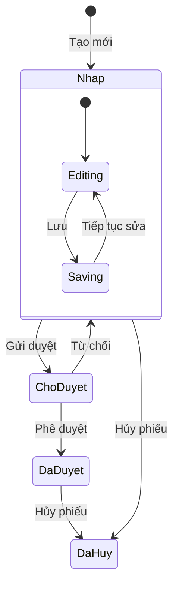
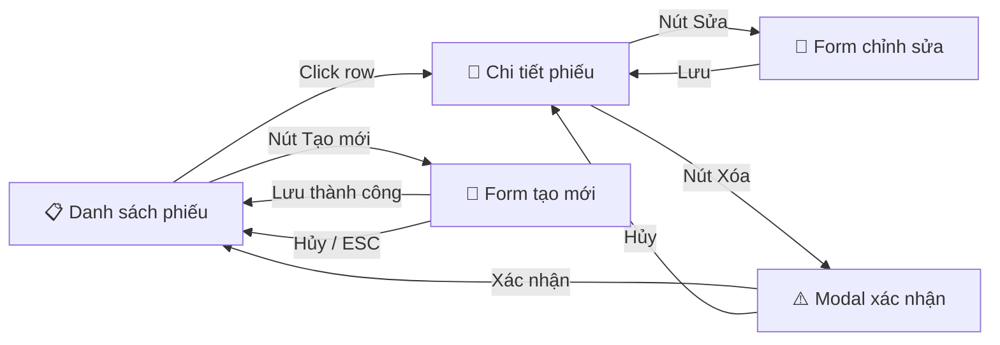
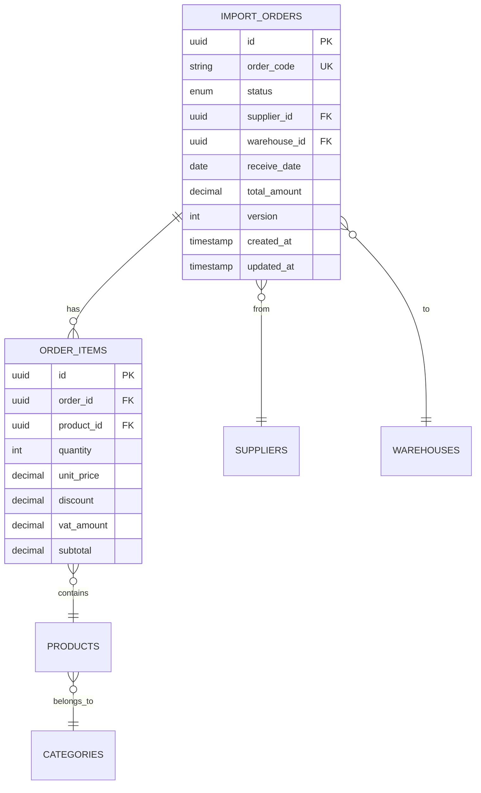
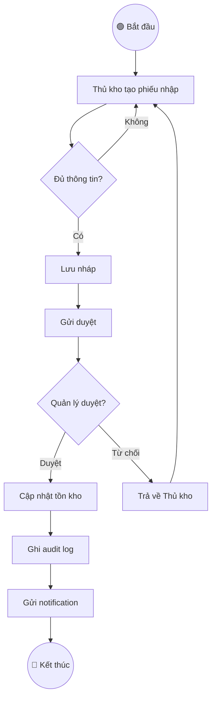
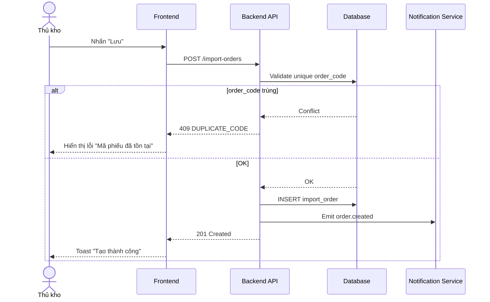
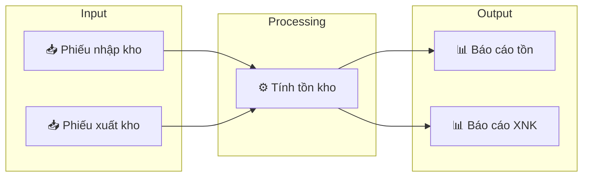

# Mermaid Diagram Patterns

Các mẫu Mermaid diagram sẵn dùng cho AI khi sinh tài liệu spec.
Luôn quote labels chứa ký tự đặc biệt (ngoặc, dấu phẩy).

---

## 1. State Machine Diagram (Vòng đời trạng thái)

**Quy tắc:**
- Mỗi state PHẢI có ít nhất 1 transition ra
- State `[*]` là điểm bắt đầu
- Label transition = Action name (khớp Button Matrix)

---

## 2. Screen Flow Diagram (Navigation)

**Quy tắc:**
- Mỗi node = 1 màn hình / modal
- Edge label = Action trigger (click, button, shortcut)
- Dùng emoji phân biệt loại: 📋 List, 📄 Detail, 📝 Form, ⚠️ Modal

---

## 3. ERD (Entity Relationship Diagram)

**Quy tắc:**
- Ghi rõ PK, FK, UK (unique key)
- Ghi data type
- Dùng cardinality chuẩn: `||--o{` (one-to-many), `}o--||` (many-to-one)

---

## 4. Activity / Flow Diagram (Luồng nghiệp vụ)

**Quy tắc:**
- Dùng `{}` cho Decision nodes
- Dùng `(())` cho Start/End
- Dùng `[]` cho Action nodes
- Mỗi Decision PHẢI có ≥ 2 nhánh

---

## 5. Sequence Diagram (Tương tác API)

**Quy tắc:**
- Dùng `actor` cho user
- Dùng `participant` cho system components
- Dùng `alt/else` cho branching
- Ghi rõ HTTP status code trong response

---

## 6. Data Flow Diagram

