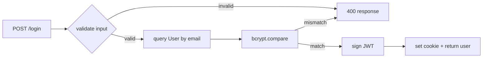

# Phase 3: 🔬 Analyze — Hiểu WHY, không chỉ HOW

**Goal:** Trước khi copy, hiểu tại sao source viết như vậy. Expose hidden assumptions.

## Compose skills

| Skill | Khi nào dùng |
|---|---|
| `ck:sequential-thinking` | Khi feature có ≥3 layers hoặc multi-step flow phức tạp |
| `ck:security` | STRIDE+OWASP scan trên code đã fetch |
| `test-automator` | Phân tích test coverage của source |

## Steps

### 3.1. Trace execution path

Từ entry point của feature:
1. Main function / API handler
2. All branches
3. Side effects (DB writes, network calls, file I/O, stateful mutations)
4. Error paths

**Output:** execution-flow diagram (mermaid) trong `.xia/cache/flow-{feature}.md`



### 3.2. Configuration surface

Identify mọi configurable input:
- Environment variables (`process.env.X`, `os.getenv`)
- Constructor arguments
- Feature flags
- Runtime config files

**Map to local convention:**

| Source pattern | Local convention | Action |
|---|---|---|
| `process.env.JWT_SECRET` | `settings.jwt_secret` (Pydantic) | Rename + add to `.env.example` |
| Hardcoded timeout `5000` | `config.TIMEOUT_MS` | Extract to config |

**Secrets handling:**
- Detect secret keys (name matching `*SECRET*`, `*KEY*`, `*TOKEN*`, `*PASSWORD*`)
- Add KEY NAMES only vào `.env.example`
- NEVER copy values (kể cả từ `.env.example` nếu có)

### 3.3. Async / concurrency analysis

Identify:
- Async/await chains → compat với local event loop?
- Promises → async generators?
- Worker threads / background jobs → local equivalent?
- Locks / mutexes → semantic preserved?

**Cross-stack gotchas** (load `resources/cross-stack-gotchas.md`):

| Source → Local | Gotcha |
|---|---|
| TS async → Python async | Await model compat ✅ nhưng GIL consideration |
| Node threads → Python threads | Python GIL = không true parallel, cần multiprocessing |
| Go channels → Python asyncio.Queue | Semantic khác (buffered vs unbuffered) |

### 3.4. Security scan fetched code

```bash
ck security --scan .xia/cache/{repo}-{sha}/ \
  --framework "STRIDE+OWASP" \
  --output .xia/cache/security-report.md
```

**Red flags để REFUSE port:**
- `eval()` + network fetch (code injection)
- `curl | bash` patterns
- Obfuscated code (base64 decode + execute)
- Known-CVE dep versions (check qua `npm audit` offline data)

**Yellow flags để WARN:**
- Hardcoded secrets (suspected)
- SQL concat without parameterization
- Missing input validation

### 3.5. Sequential thinking (conditional)

IF `layers_detected ≥ 3` OR `estimated_effort == HIGH`:
```bash
ck sequential-thinking \
  --input .xia/cache/flow-{feature}.md \
  --goal "Identify non-obvious dependencies + hidden assumptions"
```

Output: list of **implicit assumptions** (e.g., "assumes Redis available", "assumes timestamps always UTC", "relies on single-instance deployment").

### 3.6. Output → Phase 4

```yaml
execution_flow: .xia/cache/flow-auth.md
config_surface:
  env_vars: [JWT_SECRET, JWT_EXPIRY, BCRYPT_ROUNDS]
  secrets: [JWT_SECRET]  # FLAGGED - only key name
async_model: async/await (Promise-based)
concurrency_notes: "Assumes single-process; no shared-state locks"
security:
  red_flags: []
  yellow_flags: [
    "No rate limiting on /login endpoint",
    "No account lockout after N failed attempts"
  ]
implicit_assumptions:
  - "Redis available for session cache"
  - "Cookies served over HTTPS (secure flag set)"
  - "Single auth provider (no OAuth fallback)"
```

→ Feed vào Phase 4 Challenge để tạo questions.
