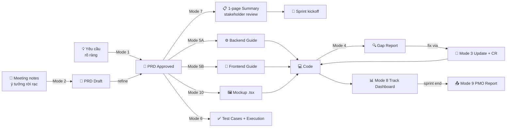

# Goal

Sinh tài liệu PRD/Spec chuẩn .md trong 10 phút (thay vì 2-3 giờ), phục vụ
toàn bộ team SDLC — từ BA viết spec, Dev implement, QA test, đến PM track
progress và báo cáo PMO — đảm bảo mọi vai trò đều đọc hiểu và sử dụng được.

---

# Quick Start — Bắt đầu trong 30 giây

| 👤 Vai trò | Câu mở đầu typical | → Mode | Output sẽ ở đâu |
|---|---|---|---|
| **BA** | *"Tạo spec cho tính năng nhập kho vật tư"* | [Mode 1](#mode-1) | `docs/specs/{module}/{Feature_ID}/spec.md` |
| **BA** | *"Em có meeting notes rời, cấu trúc giúp em"* | [Mode 2](#mode-2) | Như trên + `[⚠️ CẦN XÁC NHẬN]` ở chỗ mơ hồ |
| **BA** | *"Cập nhật spec IMS_NK_01, thêm BR_005"* | [Mode 3](#mode-3) | Same path + auto changelog |
| **Tech Lead** | *"Audit feature X — spec và code khớp không?"* | [Mode 4](#mode-4) | Gap report + RTM |
| **Dev** | *"Dev guide backend cho IMS_NK_01"* | [Mode 5A](#mode-5) | `docs/specs/.../dev_guide.md` |
| **FE Dev** | *"Dev guide frontend cho login screen"* | [Mode 5B](#mode-5) | `docs/specs/.../dev_guide.md` |
| **QA** | *"Sinh test cases cho feature IMS_NK_01"* | [Mode 6](#mode-6) | 3 files: `test_cases.md` + `test_mapping.md` + `test_execution.md` |
| **PM** | *"Tóm tắt feature X cho họp sáng mai"* | [Mode 7](#mode-7) | Output trực tiếp (không tạo file) |
| **PM** | *"Ai đang làm gì?"* · *"Tuần này tiến độ thế nào?"* | [Mode 8](#mode-8) | Dashboard markdown |
| **PM** | *"Tạo sprint report cho PMO"* | [Mode 9](#mode-9) | Executive summary + feature detail |
| **BA + FE** | *"Tạo mockup cho màn đăng nhập IMS_AUTH_01"* | [Mode 10](#mode-10) | `src/mockups/features/.../Mockup.tsx` |

📚 **Walkthrough đầy đủ từng role:** `references/quickstart-by-role.md`

---

# Pipeline end-to-end — 1 feature đi từ ý tưởng đến delivery



**10/10 modes trong pipeline:** M1 Generate · M2 Structure · M3 Update (qua CR) · M4 Audit · M5A Backend · M5B Frontend · M6 Test · **M7 Summary (stakeholder)** · M8 Track · M9 Report · M10 Mockup.

## SDLC Stage × Mode Matrix — Mode nào ở giai đoạn nào

| # | SDLC Stage | Primary Mode | Role | Trigger | Output |
|---|---|---|---|---|---|
| 1 | **Discovery** (notes rời → draft) | **M2** Structure | BA | Có meeting notes/Jira dump | Draft spec + `[⚠️ CẦN XÁC NHẬN]` |
| 2 | **Requirements** (draft → PRD) | **M1** Generate | BA | Có yêu cầu rõ ràng từ stakeholder | PRD 4 levels + diagrams |
| 3 | **Stakeholder Review** (PMO/exec) | **M7** Summary | BA + PM | Trước họp/demo/gate review | 1-page summary (không tạo file) |
| 4 | **UX/Design** (UI sandbox) | **M10** Mockup | BA + FE | Level 4 spec ready | React `.tsx` mockup |
| 5 | **Sprint Planning** (status check) | **M8** Track | PM | Đầu/giữa sprint | Progress dashboard |
| 6 | **Implementation Kickoff** | **M5A/5B** Dev Guide | Dev | Spec Approved | `dev_guide.md` (BE/FE) |
| 7 | **Test Prep** (parallel với Dev) | **M6** Test Gen | QA | Spec Approved | `test_cases.md` + `test_execution.md` |
| 8 | **Development** (scope change) | **M3** Update | BA/Dev | User feedback, bug, CR | Spec update + CR log |
| 9 | **Quality Gate** (pre-merge) | **M4** Audit | Tech Lead | PR ready hoặc pre-release | Gap + RTM + Deviation Report |
| 10 | **Release / Retrospective** | **M9** Report | PM | Sprint/release end | Executive summary + release notes |

**Mọi stage đều có mode cụ thể** → không bỏ sót artifact, không gap trong audit trail.

---

# Input/Output Contract — Cần gì, được gì

| Mode | Input tối thiểu | Output chính | Tự động sinh kèm |
|---|---|---|---|
| **1 Generate** | Feature ID + tên + mục tiêu + roles + luồng | `spec.md` (4 level) | Mermaid diagrams, Glossary, Audit Trail, Notification Rules, Gap Report |
| **2 Structure** | Text rời rạc (notes/tickets/email) | `spec.md` + `[⚠️ CẦN XÁC NHẬN]` markers | Same as Mode 1 |
| **3 Update** | Path tới spec + nội dung sửa | Updated `spec.md` + Changelog entry | Auto CR nếu Approved spec |
| **4 Audit** | Path tới spec (+ source code nếu có) | Gap Report + RTM + Deviation Report | Action items ưu tiên |
| **5A Backend** | Path tới spec | `dev_guide.md` | DB migration, API endpoints, BR pseudo-code |
| **5B Frontend** | Path tới spec | `dev_guide.md` | Component tree, Route map, Form validation UX |
| **6 Test Gen** | Path tới spec | `test_cases.md` + `test_mapping.md` + `test_execution.md` | BDD, Security tests, k6 templates, Playwright skeleton |
| **7 Summary** | Path tới spec | 1-page summary (inline output) | — |
| **8 Track** | — (auto đọc git log + changelogs) | Dashboard markdown | Progress Matrix, Scope Alerts |
| **9 Report** | Period (tuần/sprint) | Executive Summary + Feature Detail | CR Summary, Release Notes |
| **10 Mockup** | Path tới spec (Level 4 required) | `src/mockups/features/.../Mockup.tsx` | MockupHub route registration |

---

# Instructions

## Bước 0: Nhận diện Role → Zone → Mode

### Decision Tree

```
User nói gì?
│
├─ "tạo spec / viết PRD / tạo tài liệu" ────────────► 🟦 Zone BA  → Mode 1 (Generate)
├─ "có meeting notes / ghi chú rời rạc" ────────────► 🟦 Zone BA  → Mode 2 (Structure)
├─ "cập nhật spec / sửa spec / thêm BR" ────────────► 🟦 Zone BA  → Mode 3 (Update)
├─ "kiểm tra spec / so sánh code / audit" ──────────► 🟦 Zone BA  → Mode 4 (Audit)
│
├─ "dev guide / implement / API / DB schema" ───────► 🟩 Zone Dev → Mode 5 (Dev Guide)
│     └─ Hỏi sub-mode: Backend (5A) hay Frontend (5B)?
│
├─ "test cases / test matrix / sinh test / UAT" ────► 🟨 Zone QA  → Mode 6 (Test Gen)
│
├─ "tóm tắt / overview feature" ────────────────────► 🟧 Zone PM  → Mode 7 (Summary)
├─ "ai đang làm gì / tiến độ / status / track" ─────► 🟧 Zone PM  → Mode 8 (Track)
├─ "báo cáo PMO / sprint report" ───────────────────► 🟧 Zone PM  → Mode 9 (Report)
│
└─ "tạo mockup / mockup UI / vẽ giao diện" ─────────► 🟪 Zone Shared → Mode 10 (Mockup)
```

### Khi mơ hồ — Hỏi ask-back

Nếu trigger không khớp rõ bảng trên:
> *"Anh/chị đang ở vai trò nào? (BA / Dev / QA / PM / FE Dev)"*
> *"Mục tiêu cụ thể: tạo mới, cập nhật, kiểm tra, hay báo cáo?"*

### Điều chỉnh ngôn ngữ theo vai trò

PM: ngắn, business (L1-2) · BA: đầy đủ template (L1-4) · Dev: code-centric (L3-4) · QA: AC-focused (L3-4) · FE Dev: UI/component (L3-4)

---

## 🟦 Zone BA — Business Analyst (Mode 1-4)

### Mode 1: Generate — Sinh PRD mới

📚 **Template:** `references/templates/prd-template.md`

1. Hỏi BA thông tin tối thiểu:
   - Feature ID & tên (VD: `IMS_NK_01` - Nhập kho vật tư)
   - Mục tiêu nghiệp vụ (bài toán giải quyết)
   - User chính (roles)
   - Luồng nghiệp vụ tổng quát
2. Sinh tài liệu PRD 4 level:
   - **Level 1**: Product Overview (PM, BA)
   - **Level 2**: Epic/Module (Architect, PM)
   - **Level 3**: Feature Detail — User Story, State Machine, Button Matrix (Dev, QA)
   - **Level 4**: Sub-feature — UI Spec, Business Rules, Validation, API, AC (Dev, QA)
3. Tự động sinh Mermaid diagrams (📚 `references/patterns/mermaid-patterns.md`):
   State Machine, Screen Flow, ERD
4. Tự động thêm: Glossary, Notification Rules, Audit Trail, Risk Assessment, Data Migration Notes
5. Output: `docs/specs/{module}/{Feature_ID}_{tên_snake_case}/spec.md`
   > Mermaid inline trong spec.md. Chỉ tách `diagrams.md` khi > 500 dòng.
6. Tạo/update `docs/specs/{module}/README.md` — index features
7. ✅ VERIFY: Chạy gap detection (📚 `references/rules/gap-detection-rules.md`)
   - **AUTO-FIX** gap 🔴 Critical → bổ sung trước khi trả output

### Mode 2: Structure — Cấu trúc hóa thông tin rời rạc

1. Nhận input: meeting notes, Jira tickets, email, text tự do
2. Trích xuất: features, rules, roles, flows, fields, edge cases
3. Sinh PRD chuẩn template (giống Mode 1, bước 2-7)
4. Đánh dấu `[⚠️ CẦN XÁC NHẬN]` ở chỗ AI không chắc chắn
5. ✅ VERIFY: gap detection

### Mode 3: Update — Cập nhật spec đã có

1. Đọc spec hiện tại (user chỉ path hoặc AI tìm trong `docs/specs/`)
2. Thực hiện thay đổi theo yêu cầu
3. **Auto Changelog**: thêm dòng Lịch sử thay đổi (ngày, người, nội dung, version)
4. **Scope Change Detection** (nếu spec đã Approved):
   - So sánh Scope Baseline → tính % thay đổi
   - Vượt baseline → tạo Change Request (phân loại, impact, CR Log)
5. ✅ VERIFY: gap detection sau update

### Mode 4: Audit — Kiểm tra spec & code

📚 **Quy tắc:** `references/rules/gap-detection-rules.md`

1. Đọc spec → **Gap Detection**: BR↔AC, State↔Button, Field↔Validate, cross-feature consistency
2. **Code-Spec Comparison** (nếu Dev/Tech Lead): đọc source code → sinh RTM + Deviation Report
3. **Tech Lead Review**: architecture, performance, security, tech debt checklists
4. Output: Gap Report + action items ưu tiên

---

## 🟩 Zone Dev — Developer (Mode 5)

### Mode 5: Dev Guide — Hướng dẫn implement

📚 **Template:** `references/templates/dev-guide-template.md`

Hỏi sub-mode trước: *"Backend (5A) hay Frontend (5B)?"*

**5A — Backend:**
DB schema, API endpoints, BR implementation, State Machine guards,
Validation chain, Caching, Concurrency, Logging.

**5B — Frontend:**
Route mapping, Component breakdown, Conditional rendering (từ Button
Matrix), Form validation UX, UI States, a11y, Keyboard shortcuts,
Error boundaries.

Output: `docs/specs/{module}/{Feature_ID}_{tên}/dev_guide.md`

---

## 🟨 Zone QA — Quality Assurance / Tester (Mode 6)

### Mode 6: Test Gen — Sinh test artifacts

📚 **Template:** `references/templates/test-gen-template.md`
📚 **Execution:** `references/templates/test-execution-template.md`

1. Đọc spec → sinh:
   - BDD Test Cases (Given/When/Then) từ AC
   - State × Button Test Matrix
   - Regression Checklist từ Impact Matrix
   - Test Data Prerequisites
   - Security Test Scenarios (SQL injection, XSS, RBAC, IDOR)
   - Performance Test Scenarios (k6 templates)
   - Automation Skeleton (Playwright)
   - Requirement → Test Mapping
   - **Test Execution Matrix** — checkbox, status (PASSED/FAILED/BLOCKED/UNTESTED), actual result, bug ID
2. Output: `test_cases.md` + `test_mapping.md` + `test_execution.md` trong feature folder
3. `test_execution.md` bao gồm:
   - **Execution Dashboard**: tổng TC, số PASSED/FAILED/BLOCKED/UNTESTED, tỷ lệ %
   - **Execution Matrix**: mỗi TC có checkbox `[ ]`, phân loại (Happy/Negative/Edge), priority, status, actual result
   - QA có thể copy bảng sang Excel/Google Sheets để báo cáo

---

## 🟧 Zone PM — Project Manager (Mode 7-9)

### Mode 7: Summary — Tóm tắt 1 trang

Đọc spec → sinh tóm tắt: Feature name, status, owner, mục tiêu, scope metrics,
estimation, risk, dependencies, RACI. **Output trực tiếp (không tạo file).**

### Mode 8: Track — Dashboard hoạt động

📚 **Template:** `references/templates/pm-report-template.md` (Mode 8 section)

Đọc git log + spec changelogs → sinh dashboard: Progress Matrix, Recent
Activity, Scope Alerts, Warnings & Risks.

### Mode 9: Report — Báo cáo PMO

📚 **Template:** `references/templates/pm-report-template.md` (Mode 9 section)

Thu thập git log, spec status, CR log → sinh: Executive Summary, Feature
Detail, CR Summary, Risks & Blockers, Next Sprint, Release Notes,
Communication Template.

---

## 🟪 Zone Shared — BA + FE Dev (Mode 10)

### Mode 10: Mockup — Code Mockup tĩnh

📚 **Quy tắc:** `references/patterns/ui-mockup-patterns.md`

1. Đọc spec → tạo React `.tsx` tại `src/mockups/features/.../`
2. Dùng component chuẩn Design System, dummy data, đầy đủ CSS hover/form state
3. **Đồng bộ Chéo**: Mockup↔Spec — **HỎI user trước khi sửa `.md`**
4. Đăng ký route vào `MockupHub.tsx`
5. Auto-Verification: self-healing cho lỗi import/props

---

# 🏢 Enterprise Multi-role Collaboration

Project có **nhiều role cùng làm trên 1 repo** → cần guardrails để tránh xung đột, đảm bảo compliance.

## Ownership Matrix (RACI)

| Artifact | Owner chính (R) | Reviewers (A) | Consulted (C) | Informed (I) |
|---|---|---|---|---|
| `spec.md` Level 1-2 | PM | Architect | BA | Dev, QA |
| `spec.md` Level 3-4 | BA | Tech Lead, QA | PM, FE/BE Lead | Tester |
| `dev_guide.md` (5A/5B) | Tech Lead | BE/FE Lead | Architect | Dev team |
| `test_cases.md` (6) | QA Lead | QA Manager | BA, Dev | PM |
| `Mockup.tsx` (10) | FE Dev | UX Designer | BA | PM |
| Changelog | Editor | — (auto) | — | All |

📚 **CODEOWNERS setup + full RACI:** `references/enterprise-workflow.md`

## Spec Lifecycle

```
DRAFT ──────► IN_REVIEW ──────► APPROVED ──────► FROZEN ──────► DEPRECATED
   │              │                   │                              ▲
   └── Mode 1/2   │                   │                              │
                  └── Review gate     └── Mode 3 must create CR ─────┘
```

- **DRAFT**: Mode 1/2 initial — free-edit
- **IN_REVIEW**: Lock direct edit — comments only qua PR
- **APPROVED**: Mode 3 update → **PHẢI tạo Change Request** + approver sign
- **FROZEN**: Release branch — no changes except hotfix CR
- **DEPRECATED**: Feature retired — archive only

## Git Branching Strategy

| Action | Branch pattern | Merge target |
|---|---|---|
| BA tạo/sửa spec | `spec/{Feature_ID}-{slug}` | `main` via PR |
| Dev implement | `feat/{Feature_ID}-{slug}` | `main` via PR |
| Bug fix (có spec change) | `fix/{Feature_ID}-{issue}` | Mode 3 auto CR |
| Release freeze | `release/{version}` | `main` after release |
| Hotfix post-release | `hotfix/{Feature_ID}-{issue}` | `main` + release branch |

## Handoff Protocol (auto-notify)

| Mode complete | Auto-notify | Next action |
|---|---|---|
| Mode 1/2 (BA) | @Tech Lead, @QA Lead | Mode 5 + Mode 6 kickoff |
| Mode 5A (Backend) | @Backend team, @QA | Impl + Mode 6 test sync |
| Mode 5B (Frontend) | @FE team, @UX | Impl + Mode 10 mockup align |
| Mode 6 (QA) | @Dev team, @PM | Execute tests per matrix |
| Mode 4 (Audit) | @Tech Lead, @PM | Triage action items |
| Mode 3 + CR | @Approvers, @PMO | Sign CR, update sprint |

Notification channels: commit message `[notify: @team]` → hook parse + post Slack/Teams.

## Enterprise spec frontmatter

Mọi spec enterprise cần thêm các field:
```yaml
jira_id: IMS-123        # Link Jira epic
sprint: Sprint-12       # Sprint alignment
status: APPROVED        # Lifecycle state
classification: Internal  # Public / Internal / Confidential
approvers:              # Require sign-off trước khi APPROVED
  - name: Nguyễn Văn A
    role: PM
    signed: 2026-04-10
  - name: Trần Văn B
    role: Architect
    signed: 2026-04-11
stakeholders: [BA, Dev, QA, PM, Legal]
depends_on: [IMS_NK_00]    # Cross-feature deps
blocked_by: []
```

📚 **Template đầy đủ:** `references/templates/spec-frontmatter-enterprise.md`

## Compliance & Audit

- **Audit trail**: mọi Mode 1/3 commit có message chuẩn `feat(spec): {Feature_ID} - {action}`
- **Sign-off**: Approvers list trong frontmatter — required cho APPROVED status
- **Data classification**: Confidential specs không commit lên public remote
- **Retention**: DEPRECATED specs archive vào `docs/specs/_archive/{year}/`

📚 **Onboarding member mới · Metrics/KPI · Sprint alignment · Notification setup:** `references/enterprise-workflow.md`

---

# Common Pitfalls — Tránh lỗi phổ biến

Top 3 lỗi hay gặp nhất:

- ❌ Mode 1 với input thiếu (chỉ có tên feature) → AI bịa → cung cấp Feature ID + roles + luồng
- ❌ Mode 3 update Approved spec không tạo CR → mất audit trail → để auto tạo CR
- ❌ Mode 10 auto-update `.md` khi sửa `.tsx` → mất intent BA → PHẢI hỏi trước khi sync

📚 **Full 14 pitfalls với giải thích:** `references/common-pitfalls.md`

---

# Examples

## 🟦 Zone BA

### Ví dụ 1 — Mode 1 Generate: BA tạo spec mới
> *"Tạo spec cho tính năng nhập kho vật tư. Thủ kho tạo phiếu nhập, quản lý duyệt."*

→ AI sinh `docs/specs/inventory/IMS_NK_01_nhap_kho/spec.md` với 4 level,
State Machine, BR, AC BDD, Button Matrix, gap report.
📚 *Chi tiết: `examples/example-dispatch-order.md`*

### Ví dụ 2 — Mode 2 Structure: BA có meeting notes rời
> *"Đây là notes meeting phòng kho, cấu trúc giúp em:
> 'Thủ kho nhập phiếu, ghi loại vật tư, số lượng. Quản lý duyệt. Nếu vật tư hết hạn thì cảnh báo...'"*

→ AI trích xuất roles (Thủ kho, Quản lý), states (Draft → Submitted → Approved),
BR (cảnh báo hết hạn), sinh PRD 4 level + `[⚠️ CẦN XÁC NHẬN]` ở chỗ mơ hồ.

### Ví dụ 3 — Mode 4 Audit: Tech Lead kiểm tra spec ↔ code
> *"Audit feature IMS_NK_01 — spec và code có khớp không?"*

→ AI đọc `spec.md` + source code → sinh RTM + Deviation Report:
"⚠️ Endpoint `POST /warehouse-receipts` thiếu validation `BR_003` (kiểm tra hạn sử dụng)".

## 🟩 Zone Dev

### Ví dụ 4 — Mode 5A Backend: Dev xin hướng dẫn
> *"Tạo dev guide backend cho feature nhập kho"*

→ AI đọc spec → sinh `dev_guide.md`: DB migration, API endpoints, BR
pseudo-code, State Machine guards, Caching strategy, Logging contract.

## 🟨 Zone QA

### Ví dụ 5 — Mode 6 Test Gen: QA sinh test
> *"Sinh test cases cho IMS_NK_01"*

→ AI sinh 3 file: `test_cases.md` (BDD 25 cases), `test_mapping.md` (RTM),
`test_execution.md` (checkbox matrix với status/priority/actual result).

## 🟧 Zone PM

### Ví dụ 6a — Mode 7 Summary: PM chuẩn bị họp stakeholder
> *"Tóm tắt feature IMS_NK_01 cho họp sáng mai"*

→ AI output inline (không tạo file): Status + Owner + Scope metrics + Estimation + Risks + Dependencies + RACI. Gọn 1 trang A4.

### Ví dụ 6b — Mode 8 Track: PM hỏi tiến độ
> *"Ai đang làm gì?"*

→ AI đọc git log + changelogs → Dashboard:

| Feature | Owner | Status | Progress | Last Update |
|---------|-------|--------|----------|-------------|
| IMS_NK_01 | @dev_a | In Progress | 60% | 2d ago |
| IMS_XK_02 | @dev_b | Review | 90% | 1d ago |

### Ví dụ 6c — Mode 9 Report: PM báo cáo PMO
> *"Tạo sprint report tuần này"*

→ AI thu thập git log + CR log → sinh Executive Summary, Feature Detail,
CR Summary, Risks & Blockers, Release Notes.

## 🟪 Zone Shared

### Ví dụ 7 — Mode 10 Mockup: BA tạo mockup UI
> *"Tạo mockup cho màn hình đăng nhập, lấy chuẩn từ spec IMS_AUTH_01"*

→ AI tạo `src/mockups/features/auth/IMS_AUTH_01_Mockup.tsx` (Design System
components, dummy data, form state), đăng ký route vào `MockupHub.tsx`.

---

# Constraints

## Không được vi phạm

- 🚫 KHÔNG tự bịa dữ liệu — thiếu thông tin → hỏi user, đánh dấu `[⚠️ CẦN XÁC NHẬN]`
- 🚫 KHÔNG bỏ section template dù không có data — ghi "Chưa xác định"
- 🚫 KHÔNG hardcode API keys, passwords, tokens
- 🚫 KHÔNG auto-update spec `.md` khi user chỉ sửa mockup `.tsx` (Mode 10) — PHẢI hỏi

## Luôn luôn làm

- ✅ LUÔN chạy gap detection sau sinh/update spec (Mode 1, 2, 3)
- ✅ LUÔN auto-fix gap 🔴 Critical trước khi trả output
- ✅ LUÔN tạo Auto TOC ở đầu `spec.md`
- ✅ LUÔN tạo output theo folder `docs/specs/{module}/{Feature_ID}_{tên}/`
- ✅ LUÔN ghi Changelog khi update spec (Mode 3)
- ✅ LUÔN đảm bảo Notification Rules phủ hết State transitions có Side Effect

## Cảnh báo

- ⚠️ Spec đã Approved mà update → PHẢI tạo Change Request (Mode 3)
- ⚠️ Mermaid labels chứa ký tự đặc biệt → PHẢI quote: `"Node's Label"`
- ⚠️ SKILL.md reference `references/` cho chi tiết — KHÔNG copy template vào đây

<!-- Version: 2.4.0 -->
<!-- Last reviewed: 2026-04-14 -->
<!-- Generated by Skill Creator Ultra v1.0 -->
<!-- Changelog:
     2.4.0 (2026-04-14): All 10 modes in SDLC pipeline (added M7 Summary); SDLC Stage × Mode Matrix showing mode per lifecycle stage; M7 example. Moved Common Pitfalls to references/ to keep SKILL.md <500 lines.
     2.3.0 (2026-04-14): Enterprise multi-role: RACI, CODEOWNERS, spec lifecycle (DRAFT→APPROVED→FROZEN), git branching, handoff protocol, compliance, Jira/Slack integration + enterprise-workflow.md + spec-frontmatter-enterprise.md
     2.2.0 (2026-04-14): Added Quick Start, Pipeline diagram, Input/Output Contract, Common Pitfalls + quickstart-by-role.md
     2.1.0 (2026-04-14): Restructured 10 modes into 5 zones (BA/Dev/QA/PM/Shared) with decision tree
     2.0.0 (2026-04-13): 10 modes consolidated
-->
