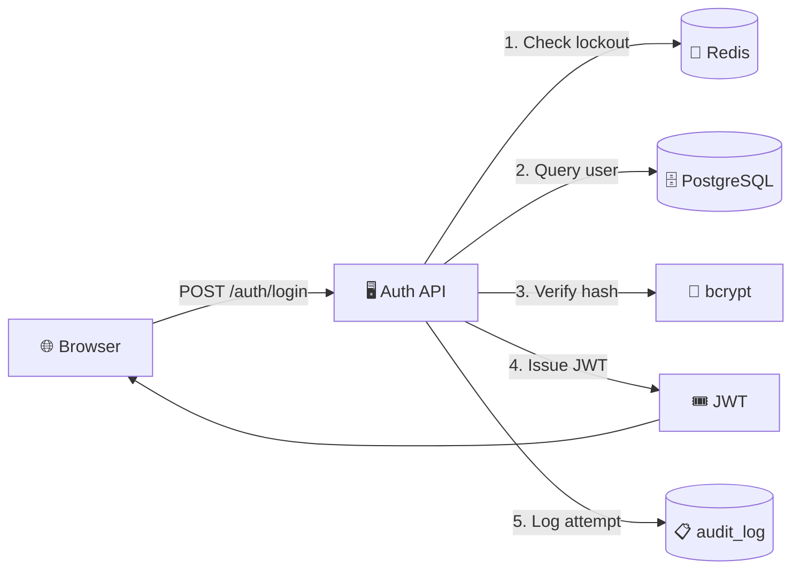
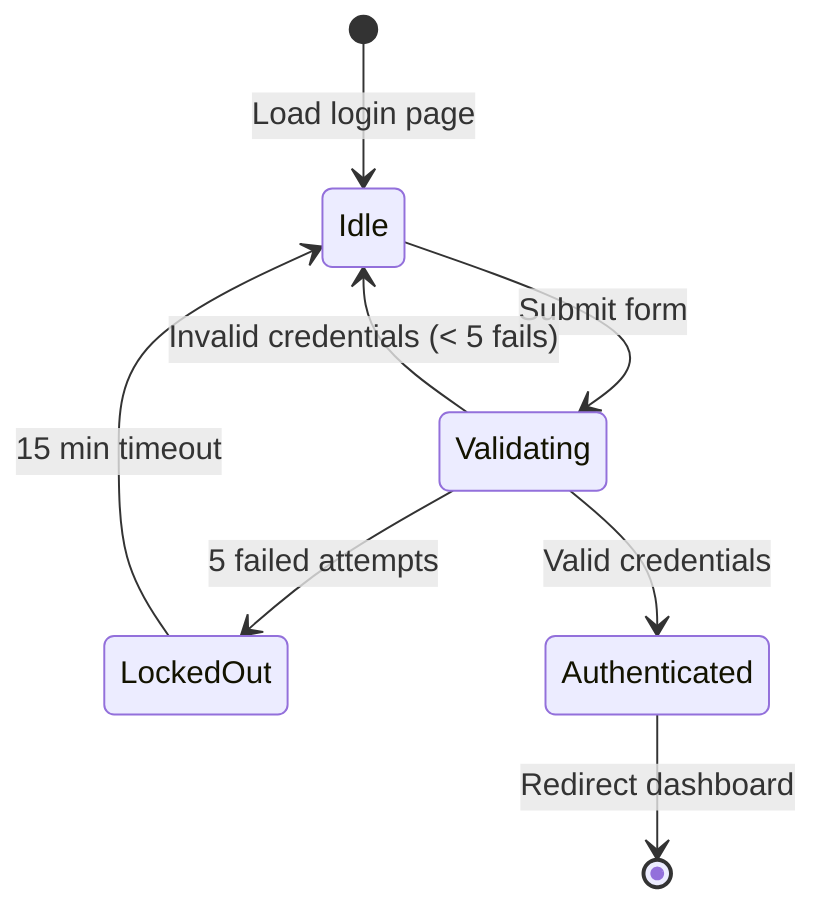
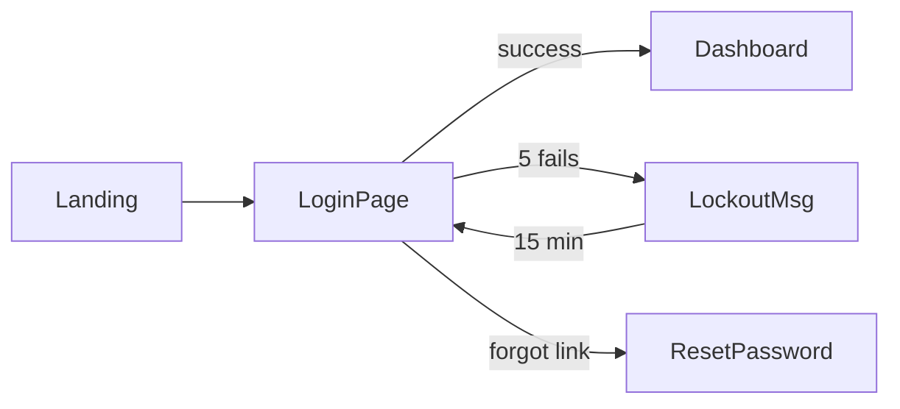

# Spec: IMS_AUTH_01 — User Login

## Table of Contents (Auto)

- [Level 1: Product Overview](#level-1-product-overview)
- [Level 2: Epic / Module](#level-2-epic--module)
- [Level 3: Feature Detail](#level-3-feature-detail)
- [Level 4: Sub-feature](#level-4-sub-feature)
- [Glossary](#glossary)
- [Notification Rules](#notification-rules)
- [Audit Trail](#audit-trail)
- [Risk Assessment](#risk-assessment)
- [Data Migration Notes](#data-migration-notes)
- [Changelog](#changelog)
- [Gap Report](#gap-report)

---

## Level 1: Product Overview

**Target users:** PM, BA, Exec

Feature cung cấp **đăng nhập an toàn bằng email + password** cho toàn hệ thống IMS. Sau khi đăng nhập thành công, user nhận JWT token để gọi API trong 24h. Hỗ trợ account lockout bảo vệ brute-force.

**Business value:**
- Gate duy nhất vào system → đảm bảo access control
- Foundation cho role-based authorization (RBAC)
- Compliance: audit trail mọi login attempt

**Success metrics:**
- Login success rate > 99%
- Avg login latency < 500ms
- Brute-force attempts blocked 100%

---

## Level 2: Epic / Module

**Target users:** Architect, PM

**Module:** `auth`
**Depends on:** N/A (foundational)
**Integrates with:** IMS_USER_01 (User management), IMS_SESSION_01 (Session)

**Tech stack:**
- Backend: Node.js + Express / FastAPI
- Storage: PostgreSQL (users table) + Redis (lockout counter, session cache)
- Auth: JWT (RS256), bcrypt (12 rounds)
- Transport: HTTPS only, SameSite=Strict cookies

**High-level architecture:**



---

## Level 3: Feature Detail

**Target users:** Dev, QA

### User Story

> **Là** User đã đăng ký
> **Tôi muốn** đăng nhập bằng email + password
> **Để** truy cập các chức năng trong hệ thống IMS

### State Machine



### Button Matrix

| State | `[Login]` button | `[Forgot password?]` link | `[Remember me]` checkbox |
|---|---|---|---|
| Idle | 🟢 Enabled | 🟢 Enabled | 🟢 Enabled |
| Validating | 🔴 Disabled (loading) | 🔴 Disabled | 🔴 Disabled |
| LockedOut | 🔴 Disabled + show countdown | 🟢 Enabled | 🔴 Disabled |
| Authenticated | — (redirected) | — | — |

### Screen Flow



---

## Level 4: Sub-feature

**Target users:** Dev, QA (full implementation detail)

### UI Spec

**Components:**
- `LoginForm` — container với 2 fields + 1 button + 1 link + 1 checkbox
- `EmailField` — input type=email, autocomplete=username, required
- `PasswordField` — input type=password, autocomplete=current-password, required, min 8 chars
- `RememberMe` — checkbox (default unchecked)
- `LoginButton` — primary CTA
- `ForgotPasswordLink` — secondary, navigate to /auth/forgot
- `ErrorBanner` — red banner top of form, dismissible

**States (visual):**
- **Default:** Form empty, all enabled
- **Validating:** Button shows spinner + text "Đang đăng nhập..."
- **Error (credentials):** Red banner "Email hoặc mật khẩu không đúng"
- **Error (lockout):** Red banner "Tài khoản tạm khóa. Thử lại sau {countdown}"
- **Success:** Brief green flash → redirect

### Business Rules

| ID | Rule | Severity |
|---|---|---|
| **BR_001** | Lockout account sau 5 lần sai password trong 15 phút | 🔴 Critical |
| **BR_002** | Password phải match bcrypt hash (12 rounds) | 🔴 Critical |
| **BR_003** | JWT expires 24h, không thể renew sau expire | 🟡 High |
| **BR_004** | Email case-insensitive (normalize lowercase trước query) | 🟡 High |
| **BR_005** | Rate limit 10 req/phút/IP cho /auth/login | 🟡 High |
| **BR_006** | Log mọi attempt (success + fail) vào `audit_log` | 🟢 Medium |
| **BR_007** | `Remember me` → JWT expires 30 ngày thay vì 24h | 🟢 Low |

### Validation

| Field | Client-side | Server-side |
|---|---|---|
| email | Required, format email, max 255 chars | Same + lowercase normalize |
| password | Required, min 8 chars | Same + bcrypt.compare |

### API Spec

**POST `/api/auth/login`**

Request:
```json
{
  "email": "user@example.com",
  "password": "secret123",
  "remember_me": false
}
```

Response 200 OK:
```json
{
  "token": "eyJhbGc...",
  "expires_in": 86400,
  "user": { "id": "uuid", "email": "user@example.com", "role": "user" }
}
```

Response 401 Unauthorized (BR_002):
```json
{ "error": "invalid_credentials", "message": "Email hoặc mật khẩu không đúng" }
```

Response 423 Locked (BR_001):
```json
{
  "error": "account_locked",
  "message": "Tài khoản tạm khóa",
  "retry_after_seconds": 840
}
```

Response 429 Too Many Requests (BR_005):
```json
{ "error": "rate_limit_exceeded", "retry_after_seconds": 60 }
```

### Acceptance Criteria (BDD)

**AC_001 — Happy path**
```gherkin
Given user "test@example.com" đã đăng ký với password "secret123"
When user POST /api/auth/login với email + password đúng
Then response 200 với `token` + `expires_in: 86400`
And audit_log có entry mới: { user_id, action: "login_success", ip, ua }
```

**AC_002 — Invalid credentials (BR_002)**
```gherkin
Given user "test@example.com" đã đăng ký
When user POST /api/auth/login với password sai
Then response 401 { error: "invalid_credentials" }
And audit_log có entry: { email, action: "login_fail", reason: "bad_password" }
```

**AC_003 — Lockout (BR_001)**
```gherkin
Given user "test@example.com" đã sai password 4 lần trong 15 phút
When user POST /api/auth/login với password sai lần thứ 5
Then response 423 { error: "account_locked", retry_after_seconds: 900 }
And Redis có key "lockout:test@example.com" với TTL 900s
And audit_log có entry: { email, action: "account_locked" }
```

**AC_004 — Case insensitive email (BR_004)**
```gherkin
Given user đã đăng ký với "Test@Example.COM"
When user POST /api/auth/login với email "test@example.com"
Then response 200 (match user dù khác case)
```

**AC_005 — Remember me (BR_007)**
```gherkin
Given user login thành công
When user tick "Remember me" trước submit
Then response có `expires_in: 2592000` (30 ngày)
Else `expires_in: 86400` (24h)
```

---

## Glossary

| Thuật ngữ | Định nghĩa |
|---|---|
| **JWT** | JSON Web Token — standard issue token có signature, format: `header.payload.signature` |
| **bcrypt** | Password hashing algo với work factor (rounds) — chậm cố ý để chống brute-force |
| **Lockout** | Trạng thái tài khoản bị khóa tạm thời sau N lần sai — chống brute-force |
| **Rate limit** | Giới hạn số request / đơn vị thời gian — chống DDoS + brute-force |
| **audit_log** | Table log mọi login attempt — compliance + forensics |

## Notification Rules

| Event | Channel | Target | Content |
|---|---|---|---|
| Login success | — | — | (chỉ log, không notify) |
| Lockout (BR_001) | Email | User | "Tài khoản của bạn bị khóa tạm thời do nhiều lần đăng nhập sai" |
| Lockout from new IP | Email | User + Security team | "Phát hiện đăng nhập bất thường từ IP X" |
| Rate limit trigger (BR_005) | Log | Security dashboard | IP, timestamp, endpoint |

## Audit Trail

Mọi event được ghi vào `audit_log`:

| Column | Type | Example |
|---|---|---|
| id | uuid | — |
| timestamp | timestamptz | `2026-04-14T10:30:00Z` |
| user_id | uuid | `abc-123` (null nếu user không tồn tại) |
| email | text | `user@example.com` |
| action | text | `login_success` / `login_fail` / `account_locked` |
| reason | text | `bad_password` / `user_not_found` / `account_locked` |
| ip | inet | `203.0.113.42` |
| user_agent | text | `Mozilla/5.0 ...` |

## Risk Assessment

| Risk | Likelihood | Impact | Mitigation |
|---|---|---|---|
| Brute-force attack | High | High | BR_001 (lockout) + BR_005 (rate limit) |
| JWT secret leak | Low | Critical | RS256 asymmetric, rotate quarterly |
| Password reset bypass | Medium | High | Separate feature IMS_AUTH_02 (out of scope) |
| Timing attack on email enumeration | Low | Medium | Return 401 generic cho cả "user not found" và "bad password" |

## Data Migration Notes

- **N/A** — Feature mới, không migrate từ hệ cũ
- Table `users` đã tồn tại (IMS_USER_01), cần thêm columns: `failed_login_count`, `locked_until`
- Migration SQL: see `dev_guide.md` (Mode 5A)

## Changelog

| Date | Author | Version | Changes |
|---|---|---|---|
| 2026-04-14 | @cuongbx | 1.0.0 | Initial draft via Mode 1 Generate |

## Gap Report

**Chạy gap detection:** `references/rules/gap-detection-rules.md`

### Cross-validation results

| Check | Status | Detail |
|---|---|---|
| BR ↔ AC mapping | ✅ PASS | 5/7 BR có AC cover (BR_004-007 cần bổ sung) |
| State ↔ Button matrix consistency | ✅ PASS | 4 states × 3 controls = 12 cells, all defined |
| Field ↔ Validation | ✅ PASS | email + password đều có client + server validation |
| Notification ↔ State transitions | 🟡 WARN | Missing: notify khi "Authenticated" (optional welcome email) |
| API ↔ AC coverage | ✅ PASS | 4 API responses mapped to AC |
| Cross-feature consistency | ✅ PASS | IMS_USER_01 compat confirmed |

### Issues

- 🔴 **Critical (0)** — Không có
- 🟡 **Medium (2)**:
  - BR_004 (case-insensitive email) chưa có AC riêng — đã thêm AC_004 ✅
  - BR_006 (audit log) thiếu AC — cần AC_006 riêng
- 🟢 **Low (1)**:
  - BR_007 (remember me) AC đơn giản, có thể expand

### Action items

1. ✅ AC_004 case-insensitive — đã có trong spec
2. ⚠️ Cần bổ sung AC_006 cho audit log requirement
3. 💡 Consider: AC_007 rate limit behavior (response 429 format)

<!-- Generated by vci-skill-cuongbx Mode 1 Generate on 2026-04-14 -->
