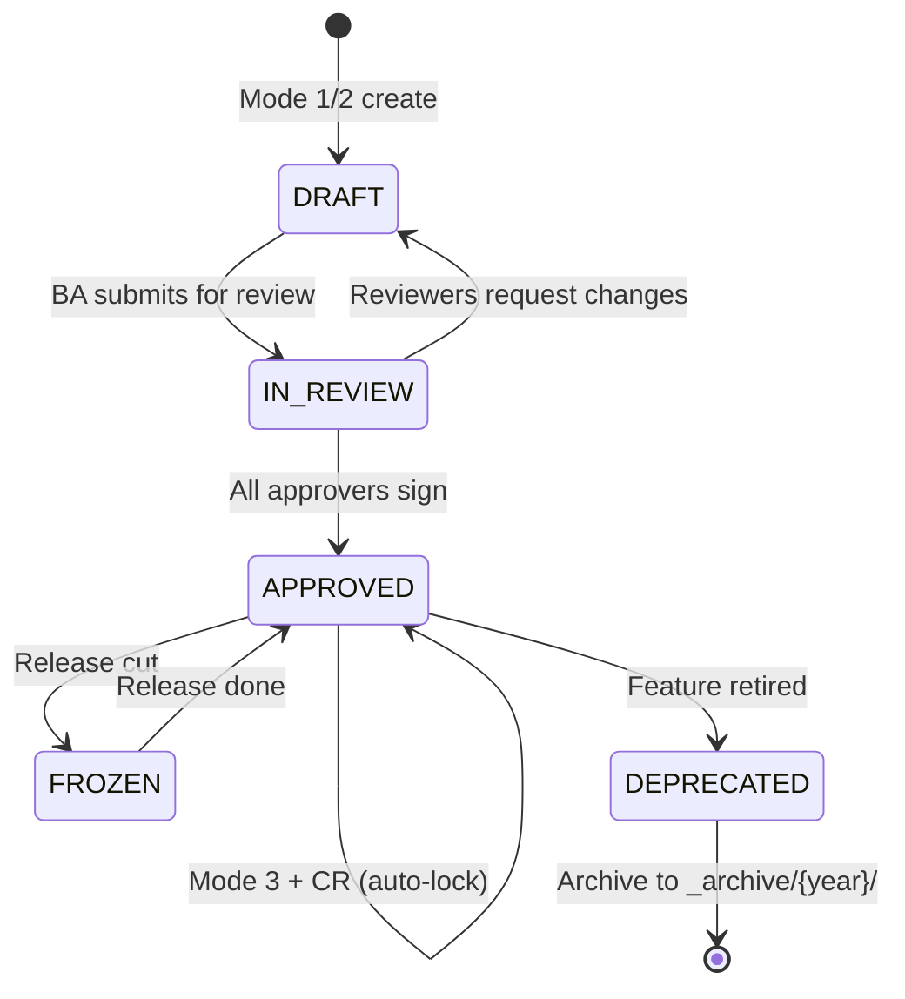
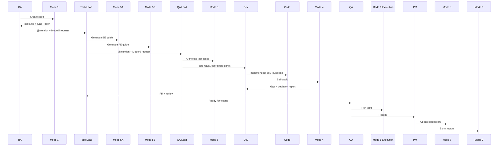

# Enterprise Multi-role Workflow Guide

Full guide cho dự án doanh nghiệp với nhiều role cùng làm trên 1 repo.

---

## 1. Ownership & RACI

### File ownership matrix

| Artifact | R (Owner) | A (Approver) | C (Consulted) | I (Informed) |
|---|---|---|---|---|
| `docs/specs/{module}/README.md` | PM | Architect | BA Lead | All |
| `spec.md` Level 1 (Overview) | PM | Product Owner | BA | Dev, QA |
| `spec.md` Level 2 (Epic/Module) | Architect | Architect Lead | PM, BA | Dev |
| `spec.md` Level 3 (Feature) | BA | Tech Lead | QA, Dev Lead | Tester |
| `spec.md` Level 4 (Sub-feature) | BA | QA Lead | Dev, UX | Tester |
| `dev_guide.md` (5A Backend) | Backend Lead | Architect | Security, DBA | Dev |
| `dev_guide.md` (5B Frontend) | FE Lead | UX Lead | A11y expert | Dev |
| `test_cases.md` | QA Lead | QA Manager | BA, Dev | PM |
| `test_mapping.md` | QA Lead | — (auto) | BA | PM |
| `test_execution.md` | Tester | QA Lead | Dev | PM |
| `Mockup.tsx` | FE Dev | UX Designer | BA | PM |
| CR log entries | BA | PMO | Impacted teams | All |

### GitHub CODEOWNERS config

Tạo `.github/CODEOWNERS`:

```
# Specs (BA ownership)
/docs/specs/**/spec.md             @org/ba-team @org/architect-team
/docs/specs/**/dev_guide.md        @org/tech-leads
/docs/specs/**/test_*.md           @org/qa-leads

# Module-specific (per-module teams)
/docs/specs/inventory/**           @org/inventory-team
/docs/specs/auth/**                @org/security-team
/docs/specs/billing/**             @org/billing-team @org/finance-reviewers

# Code mockups
/src/mockups/**                    @org/fe-leads @org/ux-team

# Infrastructure
/.claude/skills/**                 @org/skill-maintainers
```

### Role permissions (enforced via GitHub branch protection)

| Branch | Who can push | Who can approve PR | Min approvers |
|---|---|---|---|
| `main` | Nobody direct | Tech Lead, PM, Architect | 2 |
| `release/*` | Nobody direct | Tech Lead + Release Manager | 2 |
| `spec/*` | BA | Tech Lead, QA, Architect | 1 |
| `feat/*` | Dev | Peer Dev + Tech Lead | 1 |
| `fix/*` | Dev | Tech Lead | 1 |
| `hotfix/*` | Senior Dev | Tech Lead + PM | 2 |

---

## 2. Spec Lifecycle & Approval Workflow

### States



### Approval gates

**DRAFT → IN_REVIEW** (BA self-submit)
- Gate: Mode 1 complete (4 levels filled), Gap Report 0 Critical 🔴
- Action: Create PR `spec/{Feature_ID}-{slug}` with label `status:in-review`

**IN_REVIEW → APPROVED**
- Gate: Required approvers all sign (per spec frontmatter)
- Default approvers: PM + Architect + QA Lead
- Action: Update frontmatter `status: APPROVED`, merge PR, tag release

**APPROVED → APPROVED (via CR)**
- Gate: Change Request created, impact assessment filled, approvers re-sign
- Action: Append to CR Log, update Changelog, trigger re-audit (Mode 4)

**APPROVED → FROZEN**
- Gate: Release branch cut
- Action: Lock spec during release week — no CR except hotfix

### Approval enforcement via frontmatter

```yaml
status: IN_REVIEW
approvers:
  - name: Nguyễn Văn A (PM)
    role: PM
    required: true
    signed: null      # null = chưa ký
  - name: Trần Văn B (Architect)
    role: Architect
    required: true
    signed: null
  - name: Lê Thị C (QA Lead)
    role: QA
    required: true
    signed: null
  - name: Phạm Văn D (Security)
    role: Security
    required: false    # optional, tùy risk level
    signed: null
```

Mode 3 hook check: nếu `status == APPROVED` + có edit → REFUSE, require CR flow.

---

## 3. Git Branching Strategy

### Per-mode branching rules

| Mode | Branch pattern | PR target | Labels |
|---|---|---|---|
| Mode 1 (Generate) | `spec/{Feature_ID}-create` | `main` | `type:spec`, `status:draft` |
| Mode 2 (Structure) | `spec/{Feature_ID}-structure` | `main` | `type:spec`, `status:draft` |
| Mode 3 (Update) | `spec/{Feature_ID}-update-{desc}` | `main` | `type:spec`, `status:in-review` |
| Mode 3 + CR | `spec/CR-{id}-{Feature_ID}` | `main` | `type:change-request` |
| Mode 4 (Audit) | — (no branch, output report) | — | — |
| Mode 5 (Dev Guide) | `docs/{Feature_ID}-dev-guide` | `main` | `type:dev-guide` |
| Mode 6 (Test Gen) | `test/{Feature_ID}-cases` | `main` | `type:test` |
| Mode 10 (Mockup) | `mockup/{Feature_ID}` | `main` | `type:mockup` |
| Code impl | `feat/{Feature_ID}-{component}` | `main` | `type:feat` |
| Bug fix | `fix/{Feature_ID}-{issue}` | `main` | `type:fix` |

### Concurrent edit handling

**Scenario: 2 BAs cùng edit spec.md**

1. BA A tạo `spec/IMS_NK_01-update-br005`
2. BA B tạo `spec/IMS_NK_01-update-br006`
3. A merge first → main updated
4. B rebase: `git rebase main` → resolve conflicts trong spec.md
5. Cả hai merge → Changelog auto-append cả 2 entries

**Mode 3 hook**: phát hiện conflict trong Changelog section → ask user merge order.

---

## 4. Handoff Protocol

### End-to-end handoff chain



### Notification rules

Commit message convention: `[notify: @team1, @team2]` at end.

```
feat(spec): IMS_NK_01 - Initial draft

- Mode 1 Generate complete
- Gap: 0 Critical, 2 Medium (see report)
- Next: awaiting Tech Lead review

[notify: @tech-leads, @qa-leads]
```

Hook `post-commit` parse `@team` → post Slack/Teams webhook với link tới commit.

### Notification templates (customize per org)

**Slack/Teams format:**
```
:book: *[Spec Ready for Review]* IMS_NK_01 — Nhập kho vật tư

• BA: @cuongbx
• Mode 1 Generate complete
• Gap Report: 0 Critical, 2 Medium
• Link: {repo}/docs/specs/inventory/IMS_NK_01_nhap_kho/spec.md
• PR: {repo}/pull/123

cc @tech-leads @qa-leads
```

---

## 5. Jira / Linear / Azure DevOps Integration

### Spec ↔ Jira linking

Spec frontmatter có `jira_id`:
```yaml
jira_id: IMS-123
jira_epic: IMS-100
```

### Auto-sync rules

- Mode 1 complete → Jira comment with spec link
- Mode 3 + CR → Jira changelog + transition status
- Mode 9 Report → aggregate Jira velocity + scope metrics

### Commit → Jira linking

Commit message format: `feat(IMS-123): {description}` → Jira auto-link via smart commits.

---

## 6. Cross-feature Dependencies

### Dependency declaration

```yaml
depends_on:
  - IMS_NK_00         # Must be delivered first
  - IMS_AUTH_01       # Runtime dep
blocked_by:
  - IMS-456           # Jira issue blocker
integrates_with:
  - IMS_NOTIFICATION  # Sibling feature, co-test
```

### Impact Matrix (in spec.md)

Bảng này sinh tự động khi Mode 1/3:

| This feature changes | Impact on | Severity | Action |
|---|---|---|---|
| Schema `warehouse_receipts` table | Feature IMS_XK_01 | HIGH | Coordinate migration |
| API `POST /warehouse-receipts` | Mobile app v3.2+ | MEDIUM | Version header |
| State transition rules | Reporting module | LOW | Re-run aggregations |

### Cascade audit

Mode 4 Audit trên feature X → auto-suggest audit trên `depends_on` features.

---

## 7. Sprint / Release Alignment

### Sprint tagging in spec

```yaml
sprint:
  planned: Sprint-12
  actual: Sprint-12    # Updated post-release
  story_points: 13
release:
  target: v2.4.0
  actual: v2.4.0
```

### Release freeze week protocol

Khi `release/{version}` branch cut:
- Mode 3 **REFUSE** edit trên specs có `release.target == current` (trừ hotfix)
- Mode 1 mới OK (future sprint)
- Mode 4 Audit encouraged — catch drift

### Release notes generation

Mode 9 `--release v2.4.0` → aggregate:
- All specs với `release.actual == v2.4.0`
- User-facing changes only (filter by classification)
- Group by module

---

## 8. Metrics & KPIs

### Per-role metrics (Mode 9 Report aggregates)

**BA metrics:**
- Specs created per sprint
- Avg time DRAFT → APPROVED
- Gap Report critical count trên mỗi spec

**Dev metrics:**
- Dev Guide complete rate (within sprint)
- Code-spec deviation rate (Mode 4)
- PR cycle time

**QA metrics:**
- Test coverage %
- TC execution pass rate
- Defect escape rate (bugs found post-release)

**PM metrics:**
- Sprint velocity
- Scope change % per sprint
- CR approval cycle time

### Dashboard example

```markdown
# Sprint-12 Dashboard (2026-03-01 → 2026-03-14)

## BA
| Metric | Value | Target | Status |
|---|---|---|---|
| Specs created | 3 | 2 | 🟢 |
| Avg DRAFT→APPROVED | 4.2d | <5d | 🟢 |
| Critical gaps | 1 | 0 | 🟡 |

## Dev (Backend)
| Metric | Value | Target | Status |
|---|---|---|---|
| Dev guides used | 3/3 | 100% | 🟢 |
| Deviations (Mode 4) | 2 | <3 | 🟢 |
```

---

## 9. Compliance & Audit (SOC2, ISO)

### Audit trail

Every spec action logged:
- `git log` — who edited, when, what
- `Changelog` — semantic change + version
- `approvers[].signed` — approval timestamps
- CR Log — change rationale + impact

### Classification

```yaml
classification: Confidential    # Public / Internal / Confidential / Restricted
data_types:
  - PII (user email, phone)
  - PCI (credit card fragments)
retention_period: 7-years       # Regulatory
```

Rules:
- **Confidential/Restricted**: không commit lên public remote, no external AI analysis
- **Internal**: normal handling + access log
- **Public**: OK to share (marketing, open source)

### Audit reporting (Mode 9)

```
/xia audit --compliance SOC2 --period Q1-2026
```

Output:
- All spec changes với approvers
- All CR với impact + approval
- Deviation reports summary
- Sign-off completeness

---

## 10. Onboarding New Team Member

### Day 1 checklist

1. **Read skill docs** (30 min):
   - [ ] `SKILL.md` — overview 10 modes
   - [ ] `references/quickstart-by-role.md` — role-specific walkthrough
   - [ ] `references/enterprise-workflow.md` — this file
2. **Join notifications** (10 min):
   - [ ] Slack #specs channel
   - [ ] GitHub team membership
   - [ ] Jira project access
3. **Shadow first Mode 1** (1 hour):
   - [ ] Pair với senior BA
   - [ ] Review 3 existing specs in module
   - [ ] Try Mode 1 on simple feature
4. **First PR** (ngày 2-3):
   - [ ] Create simple spec via Mode 1
   - [ ] Get review từ BA Lead + Tech Lead
   - [ ] Merge after approvals

### Mentor assignment

| New role | Mentor |
|---|---|
| Junior BA | Senior BA + PM |
| Junior Dev | Tech Lead |
| Junior QA | QA Lead |
| Junior PM | Senior PM |

---

## 11. Team Conventions (Customize per org)

### Feature ID prefix

```
IMS_  = Inventory Management System
AUTH_ = Authentication
BIL_  = Billing
RPT_  = Reporting
```

### Module directory structure

```
docs/specs/{module}/
├── README.md                      # Module index
├── IMS_NK_01_nhap_kho/
│   ├── spec.md
│   ├── dev_guide.md
│   ├── test_cases.md
│   ├── test_mapping.md
│   └── test_execution.md
└── _archive/                      # Deprecated specs
    └── 2025/
```

### Versioning

- Spec: `major.minor.patch` (semantic)
  - Major: breaking scope change
  - Minor: additive (new BR, new AC)
  - Patch: typo, clarification
- Dev Guide: follows spec version
- Tests: independent, tagged with spec version tested

### Commit message format

```
<type>(<scope>): <subject>

<body>

<footer with [notify: ...] and [jira: ...]>
```

Types: `feat`, `fix`, `docs`, `refactor`, `test`, `chore`
Scope: feature ID or module name
Subject: imperative, lowercase, no period

---

## 12. Concurrent Edit Merge Strategies

### Strategy 1: Last-writer-wins (default)
- Simple, git handles it
- Risk: silent data loss in changelog
- **Mitigation**: Mode 3 hook check Changelog section for dup timestamps

### Strategy 2: Rebase + explicit merge
- BA B rebases onto main before merge
- Conflict in Changelog/BR list → resolve manually
- **Recommended for enterprise**

### Strategy 3: Feature flag branching
- Large scope changes go to `spec/{Feature_ID}-v2-experimental`
- Merged only after A/B approval
- **For high-risk changes**

### Lockfile approach (advanced)

Mode 3 creates `.spec-lock` file khi user start edit:
```yaml
# .spec-lock — auto-managed by Mode 3
IMS_NK_01_nhap_kho/spec.md:
  editor: cuongbx@email
  started: 2026-04-14T10:30:00Z
  expires: 2026-04-14T12:30:00Z   # 2 hours
```

Other BAs get warning: "spec đang được edit bởi X. Wait or force (with confirmation)."

---

## 13. Security & Privacy

### PII handling in specs

- KHÔNG paste real user data trong examples
- Use synthetic data: `user@example.com`, `+84 90 XXX XXXX`
- Dùng `{{REDACTED}}` nếu cần reference production

### Secret management

- KHÔNG commit API keys, tokens vào spec/mockup
- Use `.env.example` với placeholder keys
- Reference secret names, không bao giờ values

### Data classification trong spec

```yaml
data_handled:
  - type: PII
    fields: [email, phone]
    classification: Confidential
    retention: 7_years
    regulations: [GDPR, CCPA]
  - type: PCI
    fields: [last_4_digits]
    classification: Restricted
    regulations: [PCI-DSS]
```

Mode 4 Audit flag: feature có PII nhưng thiếu classification.

---

## 14. Backup, DR & Versioning

- Specs trong git = automatic versioning (every commit)
- `_archive/` folder cho DEPRECATED — tại sao archive + khi nào
- Quarterly backup: git bundle → offsite storage
- Spec history queryable: `git log --all -- docs/specs/**/*.md`

---

## 15. Quick reference — Common enterprise tasks

| Task | Steps |
|---|---|
| **Onboard new BA** | Read docs → shadow → first PR (ngày 2-3) |
| **Freeze release** | Cut `release/vX.Y.Z` → update all specs to FROZEN |
| **Add new approver** | Update spec frontmatter `approvers:` → require re-sign |
| **Deprecate feature** | Mode 3 → `status: DEPRECATED` → move to `_archive/` |
| **Compliance audit** | Run Mode 9 với `--compliance SOC2` flag |
| **Handle CR** | Mode 3 → CR auto-created → approvers sign → merge |
| **Rollback spec** | `git revert` + Mode 3 với CR để document rollback |
| **Cross-team dep change** | Update `depends_on` → auto-notify dependent teams |

---

## Unresolved / To customize

- [ ] Team-specific feature ID prefix list
- [ ] Slack/Teams webhook URLs (per env)
- [ ] Jira/Linear API credentials setup
- [ ] CODEOWNERS template (populate với team handles)
- [ ] Approver list per module (with backup approvers)
- [ ] Custom compliance frameworks (industry-specific)
