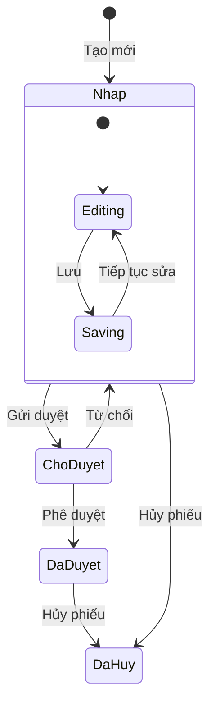
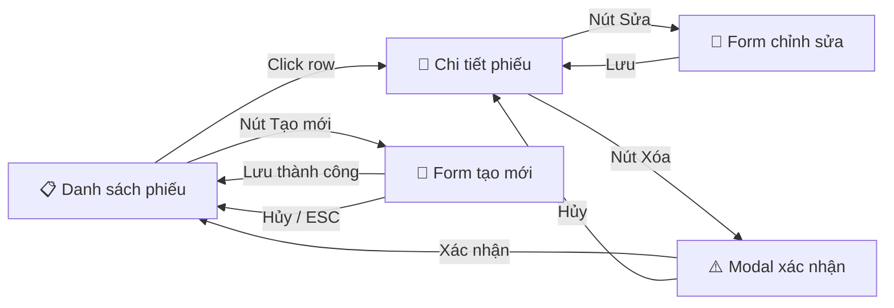
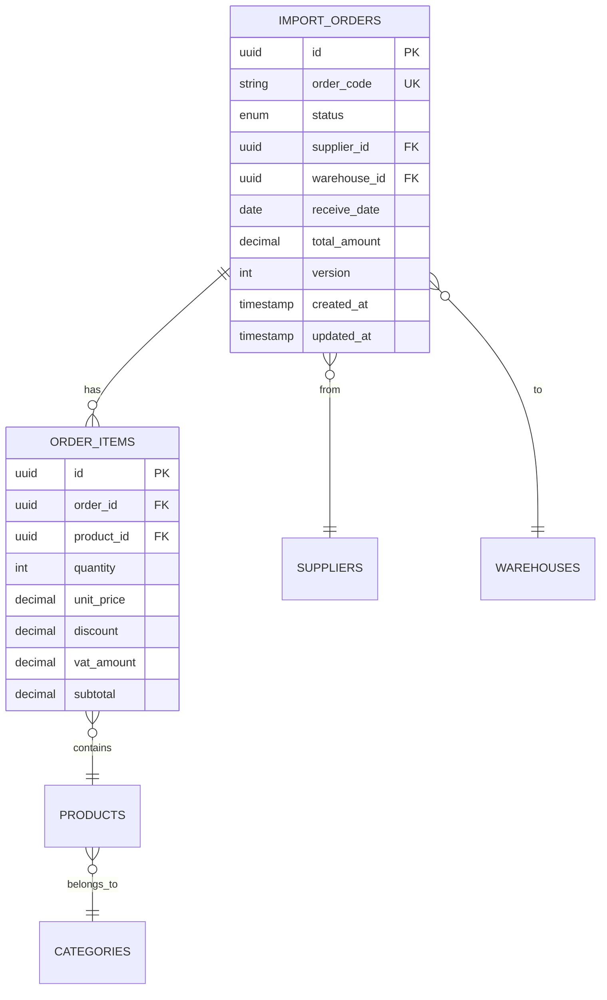
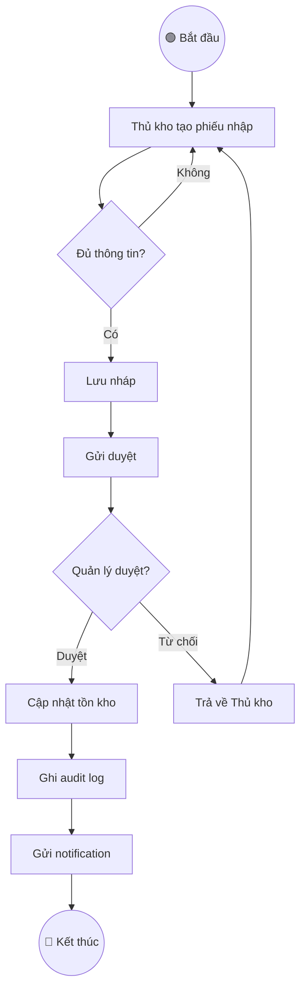
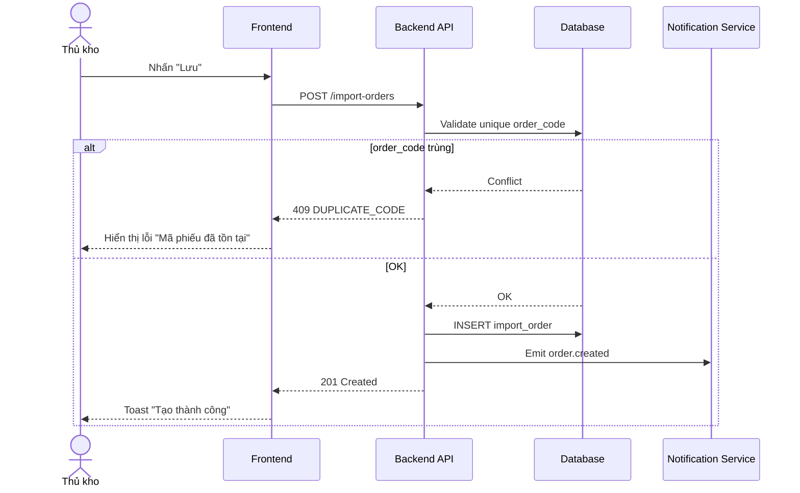
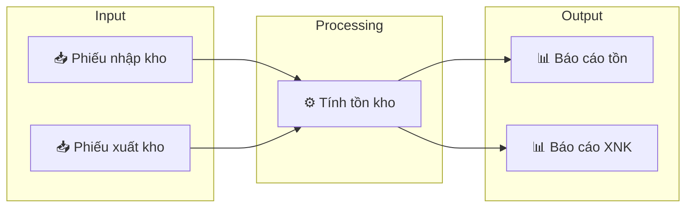

<!-- updated: 2026-05-13 -->

# Mermaid Diagram Patterns

Các mẫu Mermaid diagram sẵn dùng cho AI khi sinh tài liệu spec.
Luôn quote labels chứa ký tự đặc biệt (ngoặc, dấu phẩy).

---

## 🔍 GIAI ĐOẠN 0 — ĐỌC TRƯỚC & HỎI TRƯỚC (BẮT BUỘC)

> 🚨 **NGUYÊN TẮC:** Khi BA yêu cầu vẽ diagram, AI **KHÔNG được sinh code Mermaid ngay**. Phải Đọc → Hỏi → Confirm trước. Bỏ qua = diagram sai loại, sai mức độ chi tiết, sai render target → BA phải làm lại.

### 0.1 Pre-Read Checklist — AI tự đọc, không hỏi user

| # | Nguồn | Mục đích | Bắt buộc |
|---|---|---|---|
| 1 | Spec gốc `.md` của feature (nếu BA cung cấp Mã_Spec) | Hiểu flow / state / data model cần vẽ | ✅ Critical |
| 2 | 1-2 mermaid diagram hiện có cùng module (search `mermaid` block trong `docs/specs/`) | Mirror style, naming convention node, theme | ✅ Critical |
| 3 | File này (`mermaid-patterns.md`) — refresh 6 loại pattern | Chọn đúng loại diagram cho mục đích | ✅ Critical |
| 4 | Glossary (`docs/GLOSSARY.md` hoặc `docs/shared/GLOSSARY.md`) | Hiểu thuật ngữ nghiệp vụ (state name, action name) | 🟡 Khi có VN-specific |
| 5 | Convention naming node của project: `[Action]` vs `(State)` vs `{Decision}` | Đảm bảo consistency cross-feature | 🟡 Recommended |

### 0.2 Pre-Diagram Questionnaire — Bắt BA xác nhận

AI **BẮT BUỘC** hỏi 4-6 câu sau qua `AskUserQuestion`. **Nếu BA không trả lời → KHÔNG được sinh code Mermaid**.

- **Q1.** **Loại diagram** cần vẽ?
  - `flowchart` (luồng nghiệp vụ)
  - `sequence` (tương tác giữa actor / system)
  - `state` (vòng đời trạng thái)
  - `ER` (data model)
  - `class` (cấu trúc OOP)
  - `gantt` (timeline / sprint plan)

- **Q2.** **Mức độ chi tiết**:
  - `overview` (10-15 nodes — cho stakeholder cấp cao)
  - `detailed` (40+ nodes — cho dev/QA)
  - `hybrid` (overview + chi tiết sub-flow)

- **Q3.** **Render target** (ảnh hưởng max width + theme support):
  - GitHub markdown
  - Notion
  - Confluence
  - Slide deck (cần export PNG/SVG)

- **Q4.** **Direction**: `TD` (top-down) / `LR` (left-right) / `BT` / `RL`?
  - Mặc định: `TD` cho flowchart, `LR` cho sequence dài.

- **Q5.** **Style/Theme custom**:
  - Default Mermaid theme?
  - Brand color (cung cấp HEX)?
  - Dark mode song song?

- **Q6.** **Subgraph/Cluster** có cần không? (gom node theo nhóm logic, vd: "Backend" vs "Frontend")

### 0.3 Confirm — Tóm tắt 3-5 dòng trước khi vẽ

```
📊 TÓM TẮT TRƯỚC KHI VẼ DIAGRAM

Loại: [flowchart / sequence / state / ...]
Mức độ: [overview ~12 nodes / detailed ~40 nodes]
Target: [GitHub markdown]
Direction: [TD]
Style: [default / brand color #xxx]
Subgraph: [có/không — nhóm theo X / Y]
⚠️ Open question: [nếu có]

→ Đồng ý cấu hình trên? (Y/N hoặc góp ý)
```

**BẮT BUỘC chờ "OK" / "Đồng ý"** mới vẽ. Nếu BA muốn chỉnh sửa → lặp Q tương ứng.

### 0.4 Khi nào được rút gọn Giai đoạn 0

Được skip Pre-Questionnaire (vẫn phải Pre-Read tối thiểu Q1) khi:
- ✅ BA tường minh chỉ định: *"vẽ flowchart luồng X từ spec Y"* (đã có đủ thông tin)
- ✅ Là update diagram hiện có (chỉ thêm 1-2 node)
- ✅ Diagram nhỏ <15 nodes
- ✅ BA nói *"vẽ luôn"* / *"skip hỏi"*

**100% không hỏi gì:** CHỈ KHI BA nói "copy diagram A sang B, đổi tên — không sửa logic".

---

## 1. State Machine Diagram (Vòng đời trạng thái)



**Quy tắc:**
- Mỗi state PHẢI có ít nhất 1 transition ra
- State `[*]` là điểm bắt đầu
- Label transition = Action name (khớp Button Matrix)

---

## 2. Screen Flow Diagram (Navigation)



**Quy tắc:**
- Mỗi node = 1 màn hình / modal
- Edge label = Action trigger (click, button, shortcut)
- Dùng emoji phân biệt loại: 📋 List, 📄 Detail, 📝 Form, ⚠️ Modal

---

## 3. ERD (Entity Relationship Diagram)



**Quy tắc:**
- Ghi rõ PK, FK, UK (unique key)
- Ghi data type
- Dùng cardinality chuẩn: `||--o{` (one-to-many), `}o--||` (many-to-one)

---

## 4. Activity / Flow Diagram (Luồng nghiệp vụ)



**Quy tắc:**
- Dùng `{}` cho Decision nodes
- Dùng `(())` cho Start/End
- Dùng `[]` cho Action nodes
- Mỗi Decision PHẢI có ≥ 2 nhánh

---

## 5. Sequence Diagram (Tương tác API)



**Quy tắc:**
- Dùng `actor` cho user
- Dùng `participant` cho system components
- Dùng `alt/else` cho branching
- Ghi rõ HTTP status code trong response

---

## 6. Data Flow Diagram


